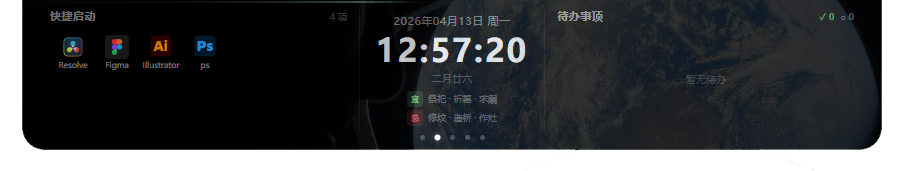
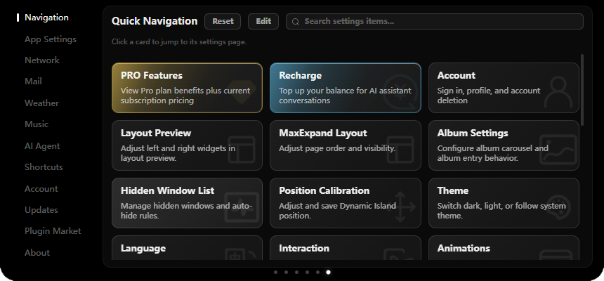
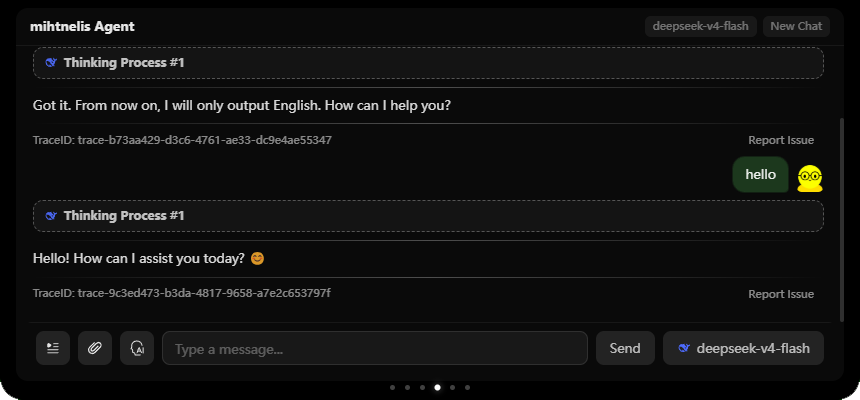
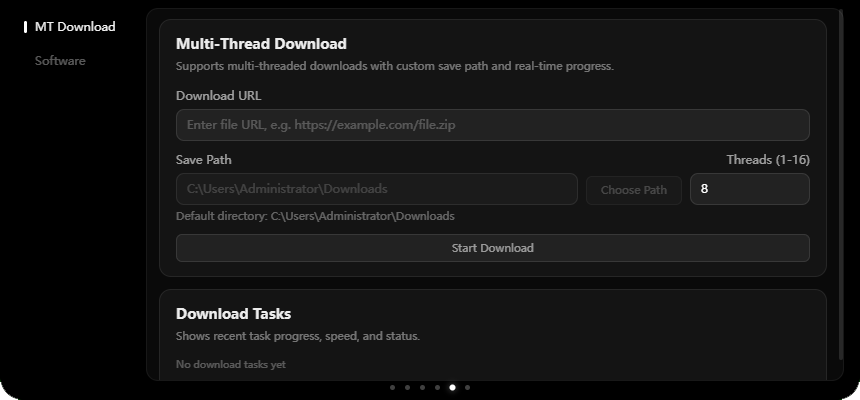

  <h1>汐月 Assa</h1>
  
<strong>Windows 顶栏的本地 AI 工具箱 · Dynamic Island 形态</strong>

  
信息一眼可见，杂事一句话可办；模型跑在你的电脑上，文件不离开这台机器。

  
Built with Electron + React + TypeScript · Python Agent sidecar

***

## 这是什么

**汐月**是一款运行在 Windows 顶栏的开源桌面应用：

- **灵动岛工具箱**：天气、歌词/网易云、系统控制、剪贴板、待办、工具箱等常驻能力
- **本地 AI**：默认本地推理（Ollama + faster-whisper + kokoro），日常任务可走规则直达，数据以不出本机为主
- **可选角色**：出厂为中性助手；可在设置中开启汐月人格与情绪回应（可关）

开源、不以盈利为目的；品牌与产品叙事独立。

> License note: GPLv3，含上游附加条款与 Windows 平台限制，见 `LICENSE`。

## UI Preview

### Overview Screen

At-a-glance view of date, weather, countdowns, and quick launch tools

### Weather Screen

Live weather and forecast with both auto-location and manual configuration

### Lyrics Screen

Real-time synced lyrics with automatic matching from multiple lyric sources

### Settings Screen

Comprehensive customization for appearance, interaction behavior, and network configuration

### Agent Screen

Built-in AI agent workspace for intelligent assistance and streamlined productivity workflows

### Toolbox Screen

Practical utility panel with quick-access tools and common software actions

***

## 致谢 / Credits

汐月的桌面形态与部分系统能力设计自 [eIsland](https://github.com/JNTMTMTM/eIsland) 获得启发；本项目代码史上基于其 GPL-3.0 开源实现演化而来。感谢 JNTMTMTM 与 pyisland.com 的工作。完整许可与附加条款见 `LICENSE`。

### 技术要点（汐月侧）

- **本地 Agent 侧车**：`agent/server.py`（HTTP `127.0.0.1:8765`），本地 Ollama + faster-whisper STT + kokoro TTS
- **网易云真实进度**：内置 netease-watcher，经本地 WebSocket 提供播放进度，用于歌词对齐
- **运行环境**：Python 3.12 venv（`.venv/`）；whisper 模型需自行放入或从备份复制；部分 node-gyp 插件需 `npm run plugins:build`

## Icon Credits

All icons used in this project are sourced from [iconfont](https://www.iconfont.cn/).

## Image Credits

The following images used in this project are from the Artemis II mission:

| Wallpaper Name         | File Name                | Capture Device    | Original Link                                                    |
| ---------------------- | ------------------------ | ----------------- | ---------------------------------------------------------------- |
| Spaceship Earth        | `art002e008487~orig.jpg` | iPhone 17 Pro Max | [images.nasa.gov](https://images.nasa.gov/details/art002e008487) |
| A Crescent Earth       | `art002e004441~orig.jpg` | NIKON Z9 35mm f/2 | [images.nasa.gov](https://images.nasa.gov/details/art002e004441) |
| Thinking of You, Earth | `art002e008486~orig.jpg` | iPhone 17 Pro Max | [images.nasa.gov](https://images.nasa.gov/details/art002e008486) |

> All images are sourced from [NASA](https://www.nasa.gov/) (National Aeronautics and Space Administration)
>
> All NASA images in this repository are used under NASA's image usage policy and do not imply NASA endorsement of this project.

More Artemis II images are available at:

- <https://images.nasa.gov/>

- <https://www.nasa.gov/artemis-ii-mobile-wallpapers/>

## License & Legal

- Terms of Service: `LEGAL/TERMS_OF_SERVICE.md`

- Privacy Policy: `LEGAL/PRIVACY_POLICY.md`

- Billing & Refund Policy: `LEGAL/BILLING_REFUND_POLICY.md`

## License

This project is released under **GNU General Public License v3.0 (GPLv3)** or later (`GPL-3.0-or-later`).

Under GPLv3 Section 7(b), limited additional terms apply: the following author attributions must be retained in all copies, modified versions, and any Appropriate Legal Notices displayed by the program:

- Copyright (C) 2026-present JNTMTMTM (<https://github.com/JNTMTMTM>)

- Copyright (C) 2026-present pyisland.com (<https://pyisland.com>)

### Platform Restriction

**This software is developed exclusively for Windows. Any porting, adaptation, or redistribution targeting Apple macOS or any Apple operating system is strictly prohibited by the original author.**

This prohibition applies to all forks, derivative works, and redistributions. Any such work must retain this restriction notice in full. Violations will be subject to legal action.

For full terms (including the standard GPLv3 text and additional clauses), see the `LICENSE` file in the repository root.
