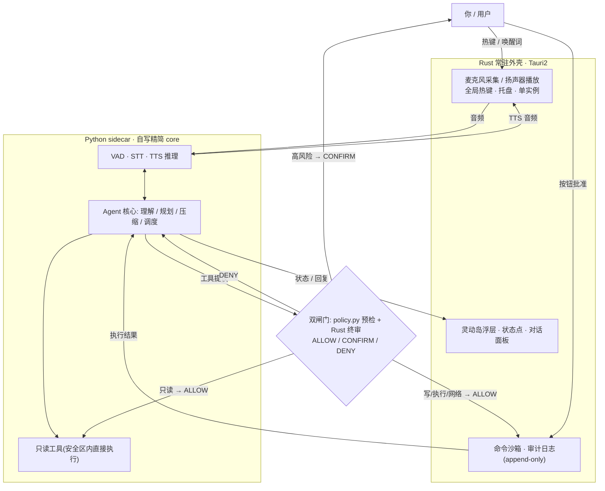
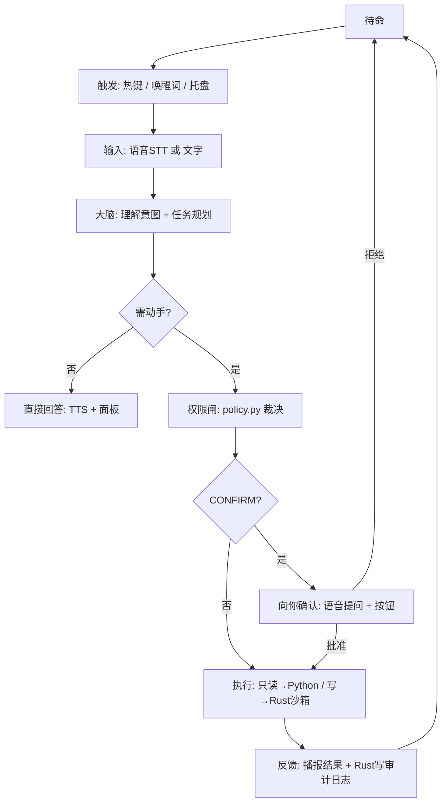

# AI 管家「汐月」· 设计方案 v1.2（全项目审查后定案 · 已批准动工）

> **状态**：8 个部分（Part 1–8）已锁定；v1.1 经设计文档审查修订，v1.2 经第二轮全项目审查（`docs/项目全面审查报告.md`）定案。**用户已批准按此执行（2026-08-30）**。
> **定位**：独立于 desk-pet 的全新项目「汐月」；「小爱同学」式本地常驻语音助手（无 Live2D、不接桌宠）。
> **栈**：Tauri2（Rust 后端 + React 前端）+ Python sidecar（**自写精简 Agent core**），镜像 desk-pet 成熟栈。
>
> **v1.2 相对 v1.1 的关键变更**（2026-08-30 全项目审查后定案，用户已批准执行）：
> 1. **裁决权定案：双闸门，Rust 为最终权威**（§3.2 / §5.2）——`policy.py` 为提议侧预检，Rust 执行前终审。
> 2. 音频采集定案：Phase 0 以 Python `sounddevice` 过渡打通回路，Phase 1 移至 Rust（§3.1 / §11.2）。
> 3. CosyVoice 集成定案：**HTTP 服务模式**（复用纳西妲 TTS 项目已有部署），模型生命周期解耦（§11.2）。
> 4. 数据路径收口：统一 `resolve_data_dir()`，开发期可用 `ASSA_DATA_DIR` 覆盖（§7.1）。
> 5. 人格文件统一命名 `agent/persona/assa.md`。
>
> **v1.1 相对 v1.0 的关键变更**：
> 1. **Part 4 由「嵌入 Hermes 核心」改为「自写精简 core + 借鉴其设计」**（实测 Hermes 不可干净剥离，详见 §9.3）。
> 2. **新增执行路由表**（§3.2），填补"Hermes Python 工具绕过 Rust 沙箱"的安全缝。
> 3. **修正语音层归属**（§3）：Rust 只做采集/播放，STT/TTS 推理归 Python sidecar。
> 4. 修正 Part 6 的 embedding 前提、补全工具清单、数据目录、Python 分发等 13 项。

---

## 目录

- [0. 一句话定位](#0-一句话定位)
- [1. 设计原则（不可妥协）](#1-设计原则不可妥协)
- [2. 已锁定决策总表](#2-已锁定决策总表)
- [3. 系统架构（三层 + 权限闸 + sidecar）](#3-系统架构三层--权限闸--sidecar)
- [4. 交互闭环（怎么用）](#4-交互闭环怎么用)
- [5. 权限与信任模型](#5-权限与信任模型)
- [6. 技术栈与模块拆分](#6-技术栈与模块拆分)
- [7. 数据目录与运行时分发](#7-数据目录与运行时分发)
- [8. 分期路线](#8-分期路线)
- [9. 风险与对策](#9-风险与对策)
- [10. 参考项目与代码复用策略](#10-参考项目与代码复用策略)
- [11. 系统分部分设计（Part 1–8 锁定详述）](#11-系统分部分设计part-18-锁定详述)
- [12. 已落地产物（仓库现状）](#12-已落地产物仓库现状)
- [13. Phase 0 动工清单（待确认后执行）](#13-phase-0-动工清单待确认后执行)
- [14. 开放问题 / 待定项](#14-开放问题--待定项)

---

## 0. 一句话定位

一个**常驻在电脑里的本地 AI 助手**：靠声音 + 角落状态点 + 短暂浮层"存在"，能听懂你的话、用语音回答你，并在你授权下**动手帮你操作电脑**；它有性格、有情绪，但**能力与情绪严格正交**——情绪只影响表达，永远不能给自己提权。

---

## 1. 设计原则（不可妥协）

1. **本地优先**：默认本地推理（Ollama）+ 本地 STT/TTS，数据不出本机；云端兜底**默认关闭**，需显式开启（见 §1.1）。
2. **最小权限**：默认 L1 协助员（能看能轻操作，动手需授权）；任何"动手"都按信任等级放行。
3. **能力与情绪正交**：人格/情绪只改语气和措辞，绝不参与授权判定。
4. **可逆 / 可审计**：删除走回收站、移动先备份；一切动作写审计日志（**Rust 独占 append-only**），可回放。
5. **人类在环**：高风险动作必须人工确认；提供一键暂停（kill switch）。
6. **执行权单一**：Python 只"提议"，所有写/执行/网络操作**物理上只能由 Rust 沙箱执行**（见 §3.2 执行路由表）。

### 1.1 云端兜底的隐私默认值
云端能力（STT 兜底、LLM 复杂任务、embedding 兜底）一律**默认关闭**；首次使用需用户在设置面板显式开启，且**首次外传前逐次提示**（语料/记忆内容外传尤其敏感）。

---

## 2. 已锁定决策总表

| 维度 | 决策 |
|---|---|
| 项目定位 | 独立于 desk-pet 的全新项目「汐月」；「小爱同学」式语音助手（无 Live2D） |
| 落地方式 | **原生重写**：Tauri2（Rust + React）+ Python sidecar。Agent core **自写精简实现**（约 600–1000 行），Hermes 仅作**设计借鉴**（v1.1 修订，依据见 §10.3） |
| 名字 / 性格 | **汐月**；真实伙伴（有情绪、不越界）；被动为主 + 允许定时/事件主动触发；严格边界 |
| LLM | 混合：本地 Ollama（qwen3-4b-32k 等小模型，受 8GB 显存约束）默认 + 复杂任务走云端（默认关） |
| 常驻 / 唤醒 | 后台常驻随时唤醒；全局热键（默认）+ 自训中文唤醒词（KWS）一起做 |
| 屏幕 | 按需截图（你下令才截，单次授权）→ 工具 `screen.capture`（v1.1 补入清单） |
| 语音 | STT = faster-whisper（GPU）；TTS = CosyVoice V3 默认 + Kokoro 兜底；VAD = Silero |
| **语音层归属**（v1.1 修正） | **Rust** = 麦克风采集 / 扬声器播放 / 热键 / 托盘；**Python sidecar** = VAD + STT + TTS 推理 |
| 权限模型 | 三层架构 + 权限闸 + 四级信任；**默认 L1 协助员**；确认以**按钮为准 + 语音辅助**；命令沙箱 = 危险黑名单 + 应用/脚本白名单；**外部内容触发的危险工具强制确认** |
| **执行路由**（v1.1 新增） | 只读工具 → Python 内执行（过 policy + 安全区校验）；写/执行/网络/凭据工具 → **必须 IPC 到 Rust 沙箱执行**；审计日志 Rust 独占 append-only |
| 长期记忆 | SQLite + 向量；复用 desk-pet L0–L3 分层引擎；**需自写 `OllamaEmbedder`**（desk-pet 现为哈希 embedding，非语义）；本地 nomic-embed-text 主 + 云端兜底（默认关）；v1 不做图 RAG |
| L1 工具 | 文件管理（安全区）/ 应用控制 / 系统状态播报 / 提醒与日历 / **截图 OCR** |
| L2 工具 | 命令行沙箱 / 浏览器自动化 / 代码辅助（项目内）/ 批量文件处理 / 代发消息（均临时提级 + 确认） |
| 代发消息 | 确认后代发（二次确认 + 审计，绝不擅自发） |
| 数据目录 | `%APPDATA%\assa\`（config / memory.db / audit.log / logs / models），详见 §7.1 |
| Python 分发 | 开发期 venv；打包期 bundle **Python embeddable package** 作为 Tauri resource，详见 §7.2 |
| 仓库 | `F:\Work\Create\Assa\assa`（monorepo：`src-tauri/` / `src/` / `agent/` / `voice/` / `schemas/` / `docs/`） |
| Phase 0 | 最小语音回路：热键 → STT → Ollama → TTS 播报，**不含工具**，先验证延迟与体验 |
| 已落地 | 仓库骨架 + `schemas/tool_schema.json` + `agent/gate/policy.py` + `agent/persona/soyue.md` + `agent/emotion.py` |

---

## 3. 系统架构（三层 + 权限闸 + sidecar）

### 3.1 架构图



**职责边界（v1.1 明确）**

| 侧 | 负责 | 不负责 |
|---|---|---|
| **Rust** | 扬声器播放、全局热键、托盘、单实例、**写/执行/网络类工具的物理执行**、命令沙箱、**审计日志独占写入**、**权限终审（最终权威）**；麦克风采集 Phase 1 起用 cpal | 任何推理（不做 STT/TTS/LLM） |
| **Python sidecar** | VAD / STT / TTS 推理、Agent 循环、上下文压缩、记忆、**只读工具执行**、麦克风采集（Phase 0 过渡用 `sounddevice`） | 任何写/执行/网络操作（只能"提议"） |
| **React 前端** | 灵动岛浮层、状态点、对话面板、设置/隐私面板 | 直接调用系统能力（一律经 Tauri IPC → Rust） |

> **为什么语音推理必须在 Python**：STT（faster-whisper）与 TTS（CosyVoice V3）均为 Python 生态实现，Rust 无成熟等价物。Rust 只保留"采集/播放"这一层硬件 I/O，音频流经 IPC 送入 Python 推理。

### 3.2 执行路由表（v1.1 新增 · 填补安全缝）

> **背景**：原方案"保留 Hermes 的 Python `tools/`"与"所有动手操作由 Rust 执行"互相矛盾——裁决通过的写操作仍会在 Python 内执行，绕过 Rust 沙箱。本表是该矛盾的**唯一正确解**，落地时必须严格遵守。

| 工具类别 | 工具 | 裁决 | **执行位置** |
|---|---|---|---|
| **只读** | `fs.list` / `fs.read` / `fs.search` / `sys.status` / `calendar.q` / `screen.capture` / `clipboard.read` | policy（ALLOW/DENY） | **Python 内直接执行** + 安全区范围校验 |
| **写** | `fs.move` / `fs.organize` / `fs.trash` / `app.launch` / `app.close` / `reminder.set` | policy + CONFIRM | **Rust 沙箱**（回收站删除 / 移动前备份） |
| **执行** | `shell.run` | policy + CONFIRM | **Rust 沙箱**（命令黑白名单 + Job Object 限资源） |
| **网络 / 凭据** | `browser.auto` / `msg.send` | policy + **强制 CONFIRM** | **Rust 沙箱** |
| **批量** | `fs.batch` | policy + **≤10 上限，逐批确认** | **Rust 沙箱** |

配套铁律：
- **双闸门（v1.2 定案）**：`policy.py` 是**提议侧预检**（不提必被拒的请求、决定何时弹确认 UI）；**Rust 执行前必须用同一份 `tool_schema.json` 终审**——预检通过 ≠ 放行，即使 Python 侧被提示注入或出 bug，也无法绕过 Rust 闸门。
- Python 侧**不得**持有任何写文件/起进程的权限路径；写操作只能序列化为 IPC 请求发往 Rust。
- **审计日志由 Rust 独占 append-only 写入**——若由 Python 写，Agent 自身可篡改，审计失去意义。

---

## 4. 交互闭环（怎么用）



### 4.1 唤醒（怎么叫它出来）
- **主：全局热键**（默认 `Ctrl+Alt+Space`，可自定义）——最稳、不常驻麦克风、隐私最好。
  > **注意**：原定的 `Ctrl+Win+Space` 在 Windows 上会被系统/输入法占用（`Win+Space` 是语言切换），
  > 注册失败会导致启动崩溃。现改为候选列表依次尝试
  > （`Ctrl+Alt+Space` → `Ctrl+Shift+Alt+Space` → `Alt+Shift+Space`），
  > 全部被占时**不 panic**，改为发 `hotkey:failed` 事件通知前端；可用环境变量 `ASSA_HOTKEY` 指定。
- **可选：唤醒词**（本地 KWS，自训中文模型）——需常驻监听麦克风，默认关闭。
- **托盘图标**右键菜单也可唤起。

### 4.2 输入
- **语音**：Phase 0 由 Python `sounddevice` 采集（过渡，少一层音频 IPC）；Phase 1 起移至 Rust（cpal）采集 → IPC → Python（Silero VAD 端点检测 → faster-whisper 转写）；嘈杂/口音重时可走云端 STT 兜底（**默认关闭**）。
- **文字**：热键弹出浮层输入框，或直接开聊天面板打字。

### 4.3 输出
- **语音**：Python 侧 CosyVoice V3 合成（Kokoro 兜底）→ IPC → Rust 播放。
- **屏幕**：不抢焦点的短暂浮层，显示"在想什么 / 在做什么 / 结果"。

### 4.4 UI 面
- **待命态**：托盘图标 + 角落极小"状态点"（颜色表心情/忙碌，由 `emotion.py` 映射 RGB）。
- **对话面板**：文字转录 + 对话历史 + 可展开看它调了哪些工具。
- **设置/隐私面板**：信任等级切换、允许文件夹白名单、审计日志查看器、一键暂停、云端兜底开关。

### 4.5 屏幕感知（已定）
**按需截图**（工具 `screen.capture`，L1 / risk=`read` / `confirm=true` 单次授权）：你下令（如"看看这个报错什么意思"）时才截图 + OCR；**不**做常驻屏幕理解。

---

## 5. 权限与信任模型

### 5.1 四级信任等级（风险递增）

| 等级 | 名称 | 能做什么 | 默认 |
|---|---|---|---|
| L0 | 观察员 | 只读、答疑、提醒；写操作全需确认 | 首次运行 |
| L1 | 协助员 | 安全区内文件、开/启应用；删除/发送需确认；不碰系统盘 | **日常默认** |
| L2 | 操作员 | 运行已批准脚本、装白名单软件；高风险二次确认；限时/限范围；全程审计 | 临时提升 |
| L3 | 自主员 | 会话内自治；一键暂停 + 事后全量回放 + 失败自动降级 | 默认关闭 |

> **注（v1.1）**：当前 `tool_schema.json` 中 16 个工具最高为 `level=2`，**尚无 level=3 工具**。启用 L3 前需显式新增 L3 工具或放宽现有工具等级，否则 L3 无可放行动作。

### 5.2 权限闸实现
- **工具注册表**：`schemas/tool_schema.json` 单一事实源（每工具带 level / risks / scope / confirm）。
- **双闸门裁决（v1.2 定案）**：
  - **预检（Python）**：`agent/gate/policy.py` 纯函数 `decide()` → ALLOW / CONFIRM / DENY——避免提出必被拒的请求、决定何时弹确认 UI。
  - **终审（Rust）**：执行前用同一份 `tool_schema.json` 复核，语义与 policy.py 保持一致；**预检通过 ≠ 放行，一切执行以 Rust 终审为准**。
- **执行**：按 §3.2 执行路由表分发到 Python 或 Rust。
- **确认 UI**：语音提问 + 屏幕按钮（以按钮为准）。
- **安全沙箱（Rust）**：命令黑白名单 + 应用/脚本白名单；删除走回收站；无 shell 逃逸（参数数组 spawn）；Windows Job Object 限 CPU/内存 + 30s 超时 + 输出截断。
- **审计日志**：Rust 独占 append-only，结构化（时间/意图/工具/参数/结果/等级），可回放。

### 5.3 通用铁律
- 删除走回收站；移动前先备份；批量上限（每次 ≤10，逐批确认）。
- 不碰凭据：密码管理器、浏览器 cookie、git token 一律隔离；记忆库永不入库凭据。
- 外部内容（网页/邮件/PDF）视为不可信，提示注入场景高风险工具必二次确认。

### 5.4 待补全项（v1.1 标注 · Phase 1 前必须完成）

> 审查发现：以下铁律当前**只写在文档里，代码尚未落地**。

| 铁律 | 现状 | 待办 |
|---|---|---|
| 安全区范围校验（scope） | `policy.decide()` 的 `params` 未使用、`ToolMeta.scope` 从不参与判定；schema 中 12 个工具的 `scope` 是死数据 | `decide()` 接收真实路径 → 比对安全区白名单；越界一律 DENY |
| 批量上限 ≤10 | 未实现 | 入 schema（`max_batch`），执行层强制截断 + 逐批确认 |
| 删除走回收站 | 未实现 | 由 Rust 执行层保证（`fs.trash` 只调回收站 API） |

---

## 6. 技术栈与模块拆分

| 模块 | 归属 | 选型 | 说明 |
|---|---|---|---|
| 常驻外壳 | **Rust** | Tauri2 | 托盘、热键、单实例、sidecar 进程守护 |
| 音频 I/O | **Rust** | cpal / rodio | 麦克风采集、扬声器播放 |
| 语音推理 | **Python** | Silero VAD + faster-whisper + CosyVoice V3 / Kokoro | 隐私优先，GPU 加速 |
| 大脑 | **Python** | Ollama（qwen3-4b-32k）默认 + 云端兜底（默认关） | 混合路由 |
| Agent 核心 | **Python** | **自写精简 core**（理解/规划/调度/压缩，约 600–1000 行） | 借鉴 Hermes 设计，见 §10.3 |
| 记忆 | **Python** | SQLite + desk-pet L0–L3 引擎 + **自写 OllamaEmbedder** | 见 §11.6 |
| 只读工具 | **Python** | 文件读/列/搜、系统状态、截图、剪贴板 | 过 policy + 安全区校验 |
| 写/执行/网络工具 | **Rust** | 命令沙箱、文件写/移动/回收站、浏览器、代发 | 见 §3.2 |
| UI | **React** | 灵动岛浮层 + 对话面板 + 设置面板 | Tauri IPC |
| 存储 | — | SQLite（记忆/审计/配置）+ 向量 | 见 §7.1 |

---

## 7. 数据目录与运行时分发

### 7.1 数据目录（v1.1 新增）
使用 Tauri 的 `app_data_dir()`，Windows 下为 `%APPDATA%\assa\`。**路径收口（v1.2）**：代码统一经 `agent.paths.resolve_data_dir()` 获取；开发期可用环境变量 `ASSA_DATA_DIR` 覆盖（指向 repo 内 `data/` 便于调试）：

```
%APPDATA%\assa\
├── config.toml        # 信任等级 / 安全区白名单 / 热键 / 云端兜底开关
├── memory.db          # 记忆库（L0–L3 分层 + 向量）
├── audit.log          # 审计日志（Rust 独占 append-only）
├── logs\              # 运行日志（按大小轮转，保留 7 天）
└── models\            # 本地模型缓存（可选；默认用 Ollama 自己的库）
```

### 7.2 Python 运行时分发（v1.1 新增）
> Tauri + Python sidecar 的经典难点，原方案未设计。

| 阶段 | 方案 |
|---|---|
| **开发期**（Phase 0–2） | 本机 Python + 独立 venv；Rust 通过配置中的绝对路径启动 sidecar |
| **打包期**（Phase 3+） | bundle **Python embeddable package**（约 15MB）作为 Tauri resource 随安装包分发；依赖在构建期用 `pip install --target` 预装进 `site-packages` |
| **高级选项** | 检测到系统 Python ≥3.11 时可复用（设置面板开关） |

> 注意：embeddable 版**不含 pip**，所有依赖必须在构建期预装；sidecar 启动失败需有明确报错与降级提示。

---

## 8. 分期路线

- **Phase 0 — 骨架**：Rust 托盘/热键/音频 I/O + Python STT→Ollama→TTS 回路。**不含工具**（L0 纯对话），验证延迟与"住进来"的感觉。
- **Phase 1 — L1 只读/轻操作**：文件搜索、截图 OCR、状态播报、提醒、开/启应用；**补全权限闸（scope 校验 / 批量上限 / 回收站）** + 审计日志 + 唤醒词 KWS。
- **Phase 2 — L1 文件操作**：安全区内读写/整理，删除走回收站，带确认；接入 desk-pet 记忆引擎 + 自写 OllamaEmbedder。
- **Phase 3 — L2 执行**：已批准脚本、浏览器自动化、受限 shell（Rust 沙箱）+ 审计 + 二次确认；打包期 Python 分发方案落地。
- **Phase 4 — L3（可选）**：会话内自治，默认关闭，一键暂停 + 回放（需先补 L3 工具）。
- **并行**：人格 Prompt + 情绪状态机 + 长期记忆贯穿各阶段。

---

## 9. 风险与对策

| 风险 | 对策 |
|---|---|
| **提示注入** | 外部内容视为不可信；高风险工具强制人工确认（policy 已实现） |
| **凭据泄露** | 密码管理器/cookie/token 隔离；记忆库永不入库凭据 |
| **破坏性操作** | 回收站非删除、移动先备份、批量上限、执行权归 Rust |
| **情绪越权** | 能力与情绪正交，情绪变量不进授权判定 |
| **资源占用** | 按需加载模型、空闲卸载、Python 空闲睡眠、热路径 Rust 化 |
| **误唤醒/误执行** | 唤醒词默认关；执行前显式确认（按钮为准） |
| **Python 工具绕过沙箱**（v1.1） | §3.2 执行路由表硬约束：Python 不持有写/执行能力 |
| **审计被篡改**（v1.1） | 审计日志 Rust 独占 append-only |
| **sqlite-vec 在 Windows 加载失败**（v1.1） | 优先 `pysqlite3-binary` / `sqlean.py`；不可用时降级为「SQLite 存原始向量 + numpy 内存余弦检索」（记忆量级 <10 万条，内存足够） |
| **Python 运行时缺失**（v1.1） | 打包期 bundle embeddable Python；启动失败明确报错 |

---

## 10. 参考项目与代码复用策略

> 一句话：**自写精简 core（借鉴 Hermes 设计）；pyisland/cisland 只借设计（GPL 不抄）；RustyIsland / thanvish21（MIT）代码级借鉴灵动岛 UI 与 Rust 系统监控；desk-pet 为主力 donor。**

### 10.1 pyisland（灵动岛源项目）
- **分支**：`pyislandPyside6` / `pyislandQT`（PySide6/PyQt5）、**`cisland`（Rust + Tauri 2）**、`pyisland-wanku`（高仿 iOS）、`eIsland`（Electron+React）。
- **许可证**：**GPL-3.0**（强 copyleft）→ **禁止复制源码**，只借设计（clean-room）。
- **可借鉴 UI/UX 范式**：常驻胶囊入口（左缘半隐藏/顶部居中）、点击展开+失焦收缩、拖动重定位+吸附、空闲 opacity 减淡、亮度/音量滑块、系统状态（WiFi/蓝牙/电池）、剪贴板监听、Toast、托盘、单实例、本地 profile 持久化。

### 10.2 同类灵动岛项目（MIT，可代码级参考）

| 项目 | 栈 | 许可证 | 可借鉴点 |
|---|---|---|---|
| **RustyIsland** | Tauri + React + TS + sysinfo | **MIT** | 灵动岛组件（胶囊 ↔ 展开详情）、玻璃拟态、亮/暗、顶部居中；与 React 前端同源，**代码级借鉴最直接** |
| **thanvish21/dynamic-island** | Tauri 2 + Svelte 5 + Rust | **MIT** | Rust 模块划分范例：`system.rs`/`media.rs`/`weather.rs`/`clipboard.rs`/`notifications.rs`/`timer.rs` |

### 10.3 Hermes Agent 复用策略（v1.1 重大修订）

> **结论：由「嵌入核心模块」改为「自写精简 core + 借鉴其设计」。** 依据为实测数据，非主观判断。

#### 为什么改（实测证据）

源码位置：**`D:/hermes_env/hermes-agent/`**（MIT © 2025 Nous Research）。

| 声称要嵌入的模块 | 实际行数 |
|---|---|
| `hermes_state.py` | 13,114 |
| `run_agent.py` | 9,205 |
| `tools/approval.py` | 5,498 |
| `agent/prompt_builder.py` | 2,598 |
| `agent/memory_manager.py` | 1,291 |
| `toolsets.py` | 1,083 |
| **合计** | **≈ 32,789 行** |

全仓 **169,025 行** Python（`tools/` 127 文件、`agent/` 141、`gateway/` 54；`cli.py` 单文件 1MB）。

**关键反证——"只复用难写的上下文压缩"并不可行**：

| 项 | 行数 |
|---|---|
| `agent/context_compressor.py` | **8,027**（397 KB） |
| 其依赖闭包（`auxiliary_client` 10,769 / `agent_runtime_helpers` 4,462 / `conversation_compression` 4,419 / `model_metadata` 3,624 / `error_classifier` 2,010 / `turn_context` 1,468 / `redact` 1,427 / `context_engine` 489 / `todo_tool` 365） | **29,033** |
| **压缩器 + 闭包** | **37,060** |
| 再加 `prompt_builder` | **≈ 39,658** |

> 即"方案 C（只复用难模块）"≈ 39,658 行，**比全量嵌入（32,789 行）还重** —— 该模块不可干净剥离，方案 C 不成立。

**另两项不利因素**：
1. Hermes 源码目录**不是 git 仓库**（解压目录）→ 无法 pin commit SHA、无法追溯上游安全修复，vendor 后无法维护。
2. 其复杂度来自我们不需要的场景：多 provider token 计数、媒体/图片 token 剥离、tail anchoring、skill reload、todo 注入、failover 错误分类。我们是**单用户 / 单模型 / 纯文本 / 十余工具**。

#### 修订后的策略：自写精简 core（≈600–1000 行）

| 组件 | 自写规模 | 说明 |
|---|---|---|
| Agent 循环 | 200–400 行 | 接收 → 组装 → 调 LLM → 解析工具意图 → 路由执行 → 回写 |
| 上下文压缩（简版） | 150–250 行 | 系统提示常驻 + 最近 N 轮保留 + 更早轮次 LLM 摘要 + 工具结果截断 |
| Prompt 组装 | 100–150 行 | 分层注入：SOUL → 情绪行 → 记忆召回 → 工具清单 → 对话 |
| 工具注册与调度 | 150–200 行 | 读 `tool_schema.json`；按 §3.2 路由表分发 |

#### 仍从 Hermes 借鉴的（设计思想，不抄代码）
- **压缩策略思路**：摘要 + 保留尾部（tail anchoring）+ 工具结果截断的组合。
- **Prompt 分层组装**：系统/人格/记忆/工具/对话分层，便于注入与调试。
- **迭代预算**：防死循环（父 90 / 子 50）。
- **并行工具分类**：只读可并行、写工具路径隔离。
- **中断与转向**：双标志（对语音打断 barge-in 直接可用）。
- **技能自蒸馏**：重复模式 → `.skill` 文件（agentskills.io 标准）。
- **`redact.py` 脱敏思路**：与"不碰凭据"铁律同向，可参考其正则策略。
- **审批机制映射**：其 manual/smart/off 三档 → 我们由 `policy.py` 统一裁决。

#### 合规
若将来确实引用其少量代码片段，须在仓库附 MIT 许可声明与 NOTICE（© 2025 Nous Research）。

### 10.4 跨项目复用地图

| 我们的项目 | 可借给汐月的 | 复用类型 |
|---|---|---|
| **desk-pet**（Tauri2 + React + Python） | Tauri 脚手架/配置；Rust 后端范式（托盘/热键/音频）；Python LLM 客户端；**CosyVoice TTS 集成**；Gateway WS 协议；**记忆引擎（§11.6）**；设置 UI 范式 | 直接复用（主权代码） |
| **Ollama 面板**（D:\Ollama\panel） | 本地 Ollama HTTP 客户端；聊天/方案预设 UI；模型绑定/调参滑块 | 直接复用 |
| **MomentHub**（Tauri + Rust + SQLite） | Tauri+Rust+SQLite 工程范式；设置/隐私面板；资源监控；**`refer/NapCatQQ` → 未来 QQ 网关的 OneBot 协议参考** | 参考 + 未来 QQ 网关 |
| **Computer-Network-Design RAG** | SQLite + embedding 检索范式（与记忆同源） | 参考 |
| **每日热点推送系统**（五源） | 定时/多源抓取 → 映射"主动触发 / 早报 / cron" | 参考（未来 L2） |

> **desk-pet 是最大 donor**：覆盖"壳 + 记忆 + TTS"主干。

### 10.5 未来通道（QQ 网关）
- 保留 **Channel Adapter** 抽象；v1 只接 Tauri + 语音。
- 后续经 `qq_adapter`（OneBot / go-cqhttp，**本机自托管**更隐私）接入 QQ，走同一 Agent 路径 + 同一 `policy.py` 闸。
- QQ 入口**默认关闭**，需显式开启 + L2 确认；协议参考 MomentHub 的 `refer/NapCatQQ`。

---

## 11. 系统分部分设计（Part 1–8 锁定详述）

> 8 个部分均 ✅ 锁定。

### 11.1 Part 1 · UI 呈现层（灵动岛）✅
- **胶囊入口**：左缘半隐藏 / 顶部居中，点击展开、失焦收缩。
- **拖动重定位** + 释放吸附边缘；**空闲 N 秒 opacity 减淡**。
- **状态点**：角落小圆点，颜色取 `emotion.py` 的 `EMOTION_COLOR` 映射。
- **胶囊内容**：亮度滑块（防抖）、音量实时调节、系统状态（WiFi/蓝牙/电池）、剪贴板监听（识别 URL 快捷打开）、Toast、托盘图标、单实例保护。
- **借鉴**：RustyIsland（MIT，代码级）+ pyisland 设计范式；React + Tauri IPC。

### 11.2 Part 2 · 语音层 ✅（引擎已定，待接线）
- **Rust**：扬声器播放（rodio）；麦克风采集 **Phase 1 起用 cpal**（Phase 0 以 Python `sounddevice` 过渡打通回路，少一层音频流 IPC，先验证延迟）。
- **Python sidecar**：Silero VAD（端点检测 + 语音打断 barge-in）→ faster-whisper STT → CosyVoice V3 TTS（Kokoro 兜底）。
- **CosyVoice 集成模式（v1.2 定案）**：**HTTP 服务**——复用纳西妲 TTS 项目已有部署，汐月作为客户端调用；模型生命周期（加载/卸载）与汐月解耦，符合"显存不用即卸载"的使用习惯；Phase 0 先用 Kokoro 打通回路，CosyVoice 后接。
- **唤醒**：全局热键为主；自训中文 KWS 路线已定（训练待 Phase 1），默认关闭。
- **现状**：`voice/stt.py`、`tts.py`、`vad.py`、`wake.py` 已建骨架，待接线。

### 11.3 Part 3 · 权限闸 ✅（核心已实现，待补全）
- `schemas/tool_schema.json`：16 个工具元数据单一事实源。
- `agent/gate/policy.py`：`decide()` 已实现并通过自测（ALLOW / CONFIRM / CONFIRM / CONFIRM）。
- **待补全（Phase 1 前）**：scope 安全区校验、批量上限、回收站落地、CONFIRM→Tauri 确认 UI、审计查看器。见 §5.4。

### 11.4 Part 4 · Agent 核心 ✅（v1.1 改为自写精简 core）
- **方案**：自写精简 core（≈600–1000 行），**不 vendor Hermes 代码**；借鉴其设计思想（见 §10.3）。
- **组成**：Agent 循环 / 简版上下文压缩 / 分层 Prompt 组装 / 工具注册与调度。
- **工具边界**：所有工具调用先过 `policy.py`；按 §3.2 路由表分发（只读 Python / 其余 Rust）。
- **依赖隔离**：agent 跑在独立 venv，不污染系统 Python。

### 11.5 Part 5 · Rust 常驻外壳 ✅（sidecar 方案）
- **Rust（Tauri2 + React）**：托盘、全局热键、音频采集/播放、单实例、Python 进程守护、命令沙箱、审计日志、确认 UI。
- **Python sidecar**：语音推理 + Agent 循环 + 记忆 + 只读工具。
- **通信**：本地管道/套接字；Rust 常驻数 MB，Python 空闲睡眠、按需唤醒。
- **分发**：开发期 venv；打包期 bundle embeddable Python（§7.2）。
- **复用**：desk-pet 的 Tauri 脚手架与 Rust 后端范式。

### 11.6 Part 6 · 长期记忆 ✅（v1.1 修正 embedding 前提）
- **复用 desk-pet 生产级引擎**：`F:\Work\Create\desk_pet\desk-pet\server\hermes_core\memory\`（`memory_service.py` / `store.py` / `knowledge.py` / `archivist.py` / `scribe.py` / `librarian.py` / `hebbian.py` / `decay.py` / `learning_scheduler.py` / `fragment.py`）。
- **分层**：L0 原始对话 → L1 原子事实 → L2 场景块 → L3 用户画像（`fragment.py` 中 `LAYER_L0..L3` 已验证）。
- **⚠️ embedding 需自写**：desk-pet 当前**仅有 `LocalHashEmbedder`**（MD5 特征哈希，384 维，"适合关键词/短句近似匹配"），`nomic_embed_text` / `openai` / `ollama_generic` **未实现**（docstring 中列为"后续可扩展"）。
  → **必须自写 `OllamaEmbedder`**，否则记忆是关键词匹配而非语义召回（"重启电脑" 与 "重新启动机器" 匹配不上）。
  → 模型已就绪：`nomic-embed-text`（274MB，已装）；中文更强可选 `bge-m3`（1.2GB，已装）。
- **记什么**：偏好 / 环境 / 反馈 / 摘要 / 场景块；**凭据永不入库**；面板可查可删。
- **v1 不做图 RAG**：不引入 Neo4j，仅留 `relations` 扩展点。

### 11.7 Part 7 · 人格/情绪 ✅
- **SOUL**：`agent/persona/assa.md`（v1.2 已由 `soyue.md` 统一重命名）。含身份 / 性格 / 语气 / 硬边界 / 能力边界 / 记忆使用；运行时由 prompt_builder 注入。
- **情绪状态机**：`agent/emotion.py`，六态 {平静/愉悦/专注/疲惫/担忧/俏皮} + `EMOTION_COLOR` RGB 映射（已验证）。
- **铁律**：情绪只改表达，不碰 `policy.py`；SOUL 可改，汐月可提议微调但须用户确认。
- **待实现**：**短时衰减**（当前 `compute_emotion(ctx, prev)` 的 `prev` 参数未使用，docstring 标注"后续补全"）→ Phase 1 用 `prev` 实现滞回，避免情绪在信号边界高频跳变。

### 11.8 Part 8 · Phase 0 最小回路 ✅
- **目标**：热键 → Rust 采集 → Python STT → Ollama → Python TTS → Rust 播放；**不含工具**（L0 纯对话），验证延迟与体验。
- **前置**：`src-tauri` 工程文件补齐（`Cargo.toml` / `tauri.conf.json` / `main.rs`，**非** `cargo tauri init`）；venv 装 faster-whisper / CosyVoice / silero-vad / ollama；模型 `qwen3-4b-32k` 已装。
- **交付**：Rust 最小外壳 + Python 轻量语音回路 + 最小 UI（胶囊 + 状态点 + 转录浮层）。

---

## 12. 已落地产物（仓库现状）

```
assa/
├── README.md / .gitignore / package.json（@tauri-apps/cli devDep）
├── docs/
│   ├── AI管家设计方案.md          ← 本文件（v1.2 单一事实源）
│   ├── 设计文档审查报告.md         ← 第一轮审查（设计文档与外部依赖）
│   └── 项目全面审查报告.md         ← 第二轮审查（代码/配置/环境/就绪度）
├── schemas/
│   └── tool_schema.json          ← 工具元数据单一事实源（16 个工具）
├── src/                          ← React 前端（README 占位）
├── src-tauri/
│   ├── README.md
│   └── src/                      ← Rust 后端（空，待 Phase 0 填充）
├── voice/
│   ├── stt.py  tts.py  vad.py  wake.py   ← 语音层骨架
│   └── requirements.txt
└── agent/
    ├── main.py                   ← Agent 入口（Phase0 stub，调 Ollama）
    ├── emotion.py                ← 情绪状态机 ✅（衰减待补）
    ├── requirements.txt
    ├── gate/
    │   └── policy.py             ← 权限策略引擎 ✅（scope/批量上限待补）
    ├── memory/
    │   └── store.py              ← 记忆存储骨架
    ├── persona/
    │   └── assa.md               ← 汐月 SOUL ✅（v1.2 统一命名）
    └── tools/
        └── __init__.py           ← 工具注册入口
```

---

## 13. Phase 0 动工清单

> **状态：已完成并提交**（2026-08-30，commit `4413483`）。实测结果见下。

### 13.1 完成项与实测结果

| 清单项 | 结果 |
|---|---|
| ① Rust 工程补齐（`Cargo.toml` / `tauri.conf.json` / `src/main.rs`） | ✅ 托盘 + Ctrl+Alt+Space 热键（含回退候选） + 顶部居中无边框浮层 |
| ② Python venv + 依赖 | ✅ Python **3.12**（3.13 会因 `numpy==1.26.4` 无 wheel 而编译失败，见 §13.2 坑 1） |
| ③ 语音回路接线 | ✅ `/health`、`/chat`、`/voice` 全部实测通过 |
| ④ 最小 UI（胶囊 + 状态点 + 转录浮层） | ✅ React + vite，`dist` 已产出 |
| ⑤ 验证 | ✅ Ollama qwen3-4b-32k 中文回复；kokoro 24kHz wav（RTF≈0.4）；录音/静音降级正常 |
| ⑥ 完成标准 | ✅ 能语音对话与播报、状态点显示、无工具、权限闸未介入 |

### 13.2 Phase 0 踩到的环境坑（写进 README 一并存档）

1. **Python 版本**：`kokoro` 钉死 `numpy==1.26.4`，该版本无 cp313 wheel，3.13 下退化为源码编译并被 meson + GBK 编码错误打断 → 必须用 **Python 3.12**。
2. **HF 模型下载**：国内 `huggingface_hub` 的 HEAD 请求失败（`LocalEntryNotFoundError`），`HF_ENDPOINT=hf-mirror` / `HF_HUB_DISABLE_XET=1` 均无效 → `curl -L` 从 hf-mirror 手动下载：whisper 放 `data/models/faster-whisper-base/`（注意词表是 `vocabulary.txt` 不是 `.json`）；kokoro 放入 HF 缓存 `hub/models--hexgrad--Kokoro-82M/snapshots/<sha>/` 并写 `refs/main`。之后 `HF_HUB_OFFLINE=1` 可离线运行。另需 `ordered_set` + `misaki[zh]`（中文 G2P）。
3. **ctranslate2 的 GPU 依赖延迟暴露**：CUDA 缺 `cublas64_12.dll` 时，**加载成功但首次推理才报错** → `stt.py` 默认 CPU（`ASSA_STT_DEVICE=cuda` 可切），并在 `transcribe` 内做 GPU→CPU 降级重试。
4. **沙箱内的 cargo 锁**：WorkBuddy 沙箱会持续持有 `target*/debug/.cargo-build-lock`，导致 `cargo build` 报"拒绝访问"（无 cargo 进程、无法改名/删除）。**用户自己的终端无此问题。**

### 13.3 原始清单（存档）

1. **Rust 工程补齐**：在既有 `src-tauri/` 下建 `Cargo.toml` / `tauri.conf.json` / `src/main.rs`（**不是** `cargo tauri init`，该目录已存在）。实现托盘 + 全局热键 + 音频采集/播放。
2. **Python 环境**：建独立 venv，装 `faster-whisper` / `silero-vad` / `ollama`；CosyVoice 依赖较重，Phase 0 可先用**轻量 TTS（Kokoro 或 Edge TTS）** 打通回路以降低阻塞风险，CosyVoice 在回路跑通后替换。
3. **语音回路接线**：Rust 采集 → IPC → Python（VAD→STT→Ollama→TTS）→ IPC → Rust 播放。
4. **最小 UI**：灵动岛胶囊 + 状态点 + 对话转录浮层（静态，不接工具）。
5. **验证**：端到端延迟（说完→开播）；空闲时 Python 睡眠、Rust 常驻低占用。
6. **完成标准**：能语音对话与播报、状态点显示、延迟可接受；无工具、权限闸不介入。

---

## 14. 开放问题 / 待定项

1. **唤醒词引擎细化**：自训 KWS 的数据/模型选型，待 Phase 1。
2. **Part 4 方向已定（自写精简 core）**；若后续发现自写压缩效果不足，再评估引入 Hermes 的代价。
3. **记忆抽取精度**：Scribe 中文抽取准确率需实测，决定是否加 LLM 辅助抽取。
4. **sqlite-vec 可用性**：Windows 下扩展加载需实测；不可用则走 numpy 内存检索降级（§9）。
5. **QQ 网关**：`qq_adapter` 接入时机与默认关闭策略，待 L2 阶段。
6. **MCP 客户端**：接入哪些外部 MCP server，待 Phase 3 后评估。
7. **L3 工具缺口**：启用 L3 前需新增 level=3 工具或放宽现有工具等级（§5.1）。

---

*下一步：用户审阅本 v1.1 → 确认 → 从 Phase 0 骨架动工（见 §13）。*
