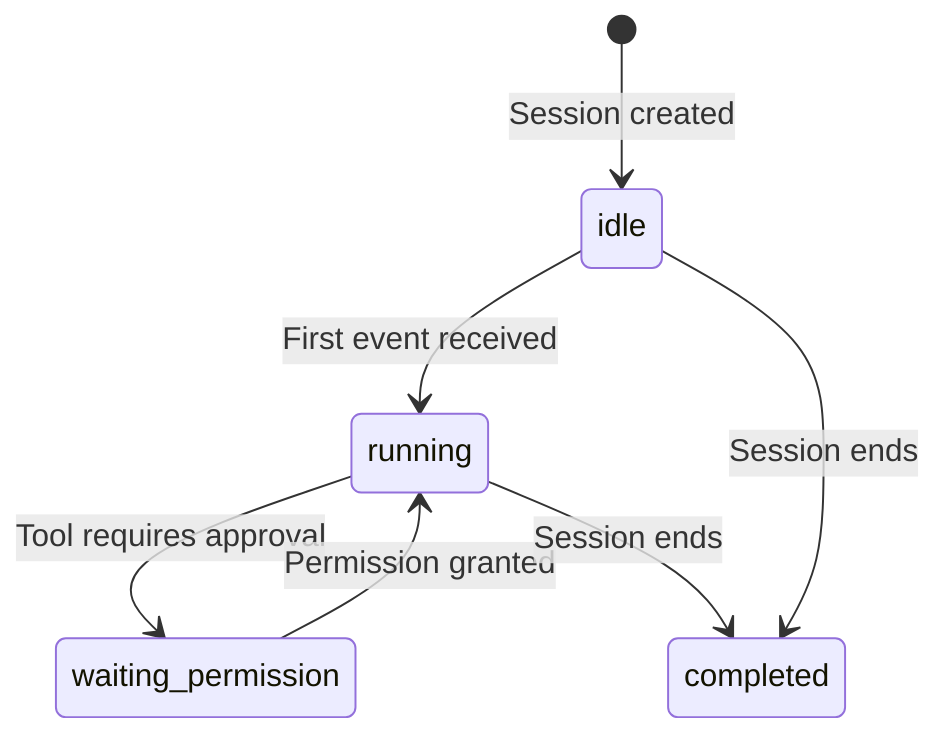
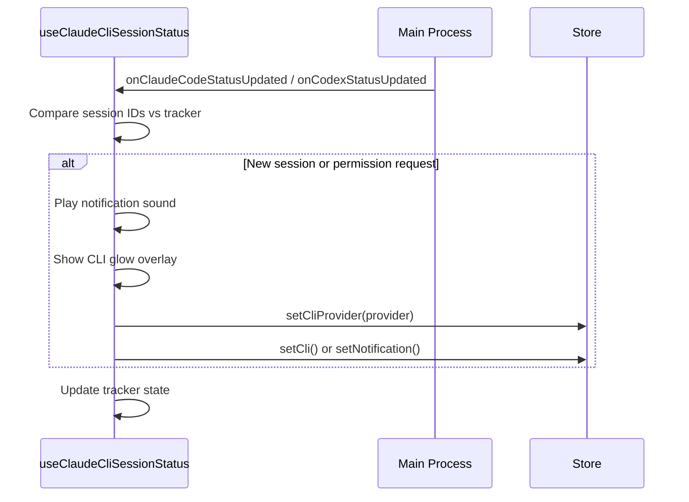

# CLI State & Codex Support

:::info
The `cli` state provides real-time monitoring of **Claude Code** and **Codex** CLI sessions directly within the island. It uses a compact island notification (500×88 px) for quick status and a full panel (860×400 px) in `maxExpand` for detailed session management. This document covers the dual-provider architecture, session lifecycle, event streaming, and permission handling.
:::

## Architecture Overview

The CLI subsystem has two layers:

| Layer | State | Dimensions | Purpose |
|-------|-------|------------|---------|
| **Island compact view** | `cli` | 500×88 px | Quick session status, permission buttons, provider toggle |
| **Full panel** | `maxExpand` (tab: `cli`) | 860×400 px | Session sidebar, event stream, activity heatmap, monitor controls |

Both layers support **two providers** via the `CliProvider` type:

```ts
type CliProvider = 'claude' | 'codex';
```

The active provider is stored in the Zustand store (`cliProvider`) and persisted to localStorage. A `CliProviderSwitch` component allows toggling between providers in both the island view and the full panel.

:::tip
The provider state persists across sessions. When a new session is detected for the inactive provider, the system automatically switches to it and shows a notification.
:::

## Provider Comparison

| Feature | Claude Code | Codex |
|---------|-------------|-------|
| Session detection | Hook-based (`onClaudeCodeStatusUpdated`) | Hook-based (`onCodexStatusUpdated`) |
| Permission flow | Deny / Allow / Always Allow | Not supported (auto-approves) |
| Island icon | Animated GIF (phase-dependent) | Static SVG with inverted filter |
| Monitor control | Install / Uninstall hook | Enable / Disable monitor |
| Event clearing | `claudeCodeEventsClear` | `codexEventsClear` |
| Session deletion | `claudeCodeSessionsDelete` | `codexSessionsDelete` |

## Session Lifecycle

A CLI session progresses through four phases:



| Phase | Description | Island Icon |
|-------|-------------|-------------|
| `idle` | Session created, no activity yet | `CLAWD_IDLE` GIF |
| `running` | Actively processing events | `CLAWD_WAITING` GIF |
| `waiting_permission` | Blocked on user approval for a tool call | `CLAWD_REVIEW` GIF |
| `completed` | Session finished (filtered out of active list) | — |

:::note
The `waiting_permission` phase triggers an automatic state transition to `cli` (if not already viewing) with a notification sound and glow overlay effect.
:::

## Entry & Exit Conditions

### Island Compact View (`cli` state)

**Entry Conditions:**
- New CLI session detected (auto-transition from any state via notification)
- Permission request received (auto-transition with sound + glow)
- Click on CLI tab with active session (from `expanded`, `maxExpand`, or `announcement`)

**Exit Conditions:**
- Close button → `idle`
- Click on body → `maxExpand` (opens full CLI panel)
- Escape key → previous state

### Full Panel (`maxExpand` with `cli` tab)

**Entry Conditions:**
- Click on CLI island body
- Navigate to CLI tab from any `maxExpand` tab

**Exit Conditions:**
- Click on island → `hover`
- Escape key → `expanded`
- Close button → `expanded`

## Session Detection Flow

The `useClaudeCliSessionStatus` hook runs in the coordinator and monitors both providers simultaneously. It uses per-provider trackers to detect new sessions and permission requests without triggering re-renders.



:::warning
The hook filters out `completed` sessions when determining if there are active sessions. A provider is considered "active" if at least one session has `phase !== 'completed'`.
:::

## Event System

Each provider streams events through IPC. The `useCliStatus` hook subscribes to real-time updates and exposes a unified snapshot:

```ts
interface CliStatusSnapshot {
  enabled: boolean;
  receiverRunning: boolean;
  receiverUrl: string | null;
  settingsPath: string;
  hookScriptPath: string;
  sessions: CliSessionSnapshot[];
  events: CliHookEvent[];
  heatmap: Record<string, { session: number; tool: number; prompt: number }>;
  updatedAt: number;
}
```

### Event Types

Events are categorized by `kind` and `eventName`. The island compact view displays the latest event summary; the full panel shows a paginated, filterable event stream.

| Field | Description |
|-------|-------------|
| `sessionId` | Which session this event belongs to |
| `kind` | Event category (e.g., `tool`, `prompt`, `system`) |
| `eventName` | Human-readable event name |
| `summary` | Short description for display |
| `timestamp` | When the event occurred |

### Activity Heatmap

The full panel includes a GitHub-style activity heatmap that visualizes session, tool, and prompt activity over time. Data is keyed by date (`YYYY-MM-DD`) and supports three metrics: `session`, `tool`, and `prompt`.

:::tip
The heatmap scrolls horizontally and auto-scrolls to today's date when the panel becomes visible.
:::

## Permission Handling

When a Claude Code session enters `waiting_permission`, the island compact view displays three action buttons:

| Button | Action | IPC Call |
|--------|--------|----------|
| **Deny** | Reject the tool call | `claudeCodePermissionResolve(sessionId, 'deny')` |
| **Allow** | Approve once | `claudeCodePermissionResolve(sessionId, 'allow')` |
| **Always Allow** | Approve this tool permanently | `claudeCodePermissionResolve(sessionId, 'always')` |

The pending tool's name, command, and description are extracted from the event's `tool_input` field and displayed alongside the permission buttons.

:::important
Permission buttons are only shown for the `claude` provider. Codex sessions do not require explicit permission approval.
:::

## Pill Mode Behavior

In `pill` shape mode, the CLI island compact view has a reduced content height:

```css
.island-shell.shape-pill .cli-state-content {
  height: 80px;
}
```

The shell background remains at 100px (shared with `notification`, `agent`, and `stt` states). The content container is centered within the shell via flexbox alignment.

## Module Structure

:::details CLI module file tree
```
states/cli/
└── CliContent.tsx                 # Island compact view component

states/maxExpand/components/cli/
├── index.ts                       # Module entry point
├── types/types.ts                 # Shared type definitions
├── config/
│   ├── cliConstants.ts            # Constants and defaults
│   └── cliFilters.ts              # Event filter definitions
├── hooks/
│   ├── useCliStatus.ts            # Provider status subscription
│   ├── useCliEvents.ts            # Event filtering and session selection
│   ├── useBulkSelect.ts           # Bulk session selection
│   ├── useEventPagination.ts      # Event list pagination
│   ├── usePendingPermissions.ts   # Permission event tracking
│   ├── useHeatmapGrid.ts          # Heatmap grid calculation
│   └── useHeatmapScroll.ts        # Heatmap scroll management
├── components/
│   ├── CliTab.tsx                 # Full panel main component
│   ├── CliProviderSwitch.tsx      # Claude/Codex toggle
│   ├── SessionSidebar.tsx         # Session list sidebar
│   ├── EventStreamPanel.tsx       # Event stream display
│   ├── EventRow.tsx               # Single event row
│   └── ActivityHeatmap.tsx        # GitHub-style heatmap
└── utils/
    ├── cliFormatters.ts           # Phase labels, date formatting
    └── heatmapGrid.ts             # Heatmap layout calculation
```
:::

## Key Hooks

| Hook | Location | Purpose |
|------|----------|---------|
| `useClaudeCliSessionStatus` | `components/hooks/` | Coordinator-level dual-provider session detection |
| `useCliStatus` | `cli/hooks/` | Per-provider status snapshot and control actions |
| `useCliEvents` | `cli/hooks/` | Event filtering, session selection, active session tracking |
| `usePendingPermissions` | `cli/hooks/` | Tracks events with `waiting_permission` phase |
| `useBulkSelect` | `cli/hooks/` | Multi-session selection for batch deletion |
| `useEventPagination` | `cli/hooks/` | Paginated event list with configurable page size |

:::note
`useClaudeCliSessionStatus` is a ref-based hook that does not trigger re-renders. It reads the Zustand store directly via `getState()` to determine whether to fire notifications or state transitions.
:::

## IPC Channels

| Channel | Direction | Description |
|---------|-----------|-------------|
| `claudeCodeStatusGet` | Renderer → Main | Fetch current Claude Code status snapshot |
| `codexStatusGet` | Renderer → Main | Fetch current Codex status snapshot |
| `onClaudeCodeStatusUpdated` | Main → Renderer | Subscribe to Claude Code status changes |
| `onCodexStatusUpdated` | Main → Renderer | Subscribe to Codex status changes |
| `claudeCodePermissionResolve` | Renderer → Main | Resolve a pending permission request |
| `claudeCodeHookInstall` | Renderer → Main | Install Claude Code hook script |
| `claudeCodeHookUninstall` | Renderer → Main | Uninstall Claude Code hook script |
| `codexMonitorEnable` | Renderer → Main | Enable Codex monitoring |
| `codexMonitorDisable` | Renderer → Main | Disable Codex monitoring |
| `cliGlowShow` | Renderer → Main | Show fullscreen CLI glow overlay |

:::danger
Never call `claudeCodePermissionResolve` without a valid session ID and action. An invalid call may leave the session in a stuck `waiting_permission` state.
:::
